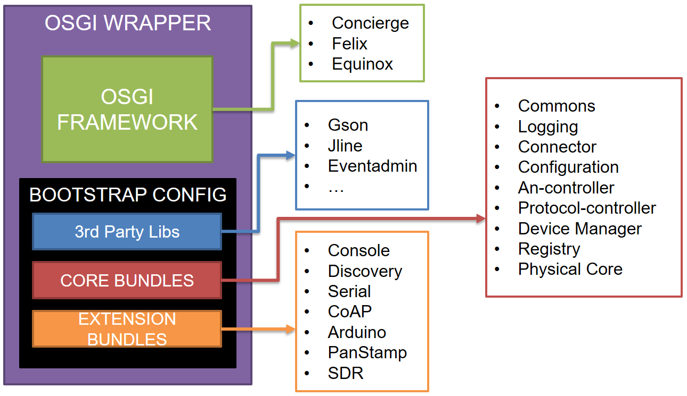

#D2D Gateway
The interoperability solution at the device layer has been developed to:

* Support interaction between tightly coupled applications and platforms.
* Enable existing sensors and actuators to communicate with the INTER-IoT solution instead of only their own system.
* Unlock service for existing platform that do not support them, or do so in an incompatible way (i.e. discovery). 
* Keep track of roaming elements to prevent them to be lost or be inaccessible.
* To enable interoperability between IoT device software as they are almost never platform independent, since companies produce proprietary/closed solutions for economical reasons.

Interoperability at the device level implies that heterogeneous IoT devices are able to interact with each other. IoT devices can be accessed/controlled through a unifying interface and integrated into any IoT platform.
This interoperability solution at device level is achieved through a Device to Device Gateway (D2D Gateway, or sometimes simplified as Gateway or GW in this documentation). There are two approaches for the implementation of this Gateway: physical and virtual.
The physical implementation of the Gateway is oriented towards hardware with medium computational capacities and storage. The virtual implementation is meant for hardware with low computational capacities and storage. In this implementation only the south part of the Gateway (network and protocol capabilities) is processed in hardware while all the other Gateway functionalities are shifted to the virtual Gateway with more computational power.
For this reason, the Gateway will be developed in Java using the OSGi framework. All components of the Gateway will be packaged as OSGi bundles and the OSGi framework will be utilized to control the bundles that will be needed depending on the chosen implementation mode.

#Architecture

The gateway architecture is shown in the "Gateway Architecture" figure below. 

*Gateway Architecture*

To understand the content first we need to define the concept of a device. For our purposes a device is a platform or hardware that is able to run a gateway as stated in the "Gateway Architecture" above. It has sufficient processing power, storage facilities and two or more connections which are omni-directional.
The gateway at the device level is designed in a way that modularity in protocols and access networks is always considered. Any access network (AN) can be inserted into the structure as long as it is interfacing accordingly with the Controller. The same is true for the protocols and middleware modules.
The device is build up in a way that once the system structure is functional a split-up can be realized. Part of the device gateway can be placed in the Cloud to allow functionalities that a physical gateway is not able to perform in an efficient way. The device Dispatcher will take care of connecting or simulating the actual platform. When connection is lost, the virtual part remains functional and will answer to requests of API and MW.
At the lowest level there are the sensors and actuators. These are connected to the AN modules. These modules take care of connectivity with the (wireless) sensors and actuators. The AN Controller will not interfere in this connectivity.
The Device Manager takes care of coupling of the AN Module to active or needed protocol. The Controllers only handle traffic routing to and from the modules.
Once a sensor/actuator is registered the Device Manager will store this information in the Registry.
When the device receives new measurement data it will be passed to the Dispatcher that will store it in the measurement storage. Any data update for the MW (or higher levels) will come from the Measurement Storage.
The Dispatcher will pass the information to the MW Controller that sets up the connection with the MW Module through which the data is sent to the MW layer (please see [INTER-IoT InterMW](../../intermw/latest/)). The MW Controller is the mediator between the MW Module which connects to a middleware solution and the rest of the gateway. This module will wrap the active MW Module in order to have a common interface for the gateway. The Gateway Configuration will be checked by to ensure that only one of the MW Modules is active. It will create the connection to the MW platform and will handle the messages interchanged between the module and the platform, as well as the messages sent to the Dispatcher. The MW Controller will be the communication interface to the middleware platform. It will use the Dispatcher in order to deliver the messages sent by the MW Module to the rest of the gateway.

In the physical architecture there are 3 different ways to connect to IoT sensors and actuators:

1. The lowest level where a connection can take place is at the Access Network controller (A.N. controller). This is for very simple sensors or actuators that have no or very limited processing power and can be off-line for longer time periods. Sensors are commonly battery powered, actuators may have a power grid connection but usually also no or very limited processing power. The A.N controller will do all routing and will serve as a master or access point for the sensors, afterwards the Protocol Controller will manipulate the data and create the messages to be sent to the virtual gateway.
2. At the middle level the dedicated sensors and actuators can connect, these are the COTS IoT devices. Usually these sensors and actuators have some dedicated communication protocol between the wireless sensor and some piece of electronics with a small processing core. They are capable of handling their own access controller and protocol controller and can be connected through a dedicated extension module implementing a Device Controller.
3. At the highest level we find the COTS IoT systems, they manage their own gateway and protocols and A.N. controllers. These systems can be connected via the connector directly to the Virtual Gateway of the Inter-IoT system. In this case, the COTS system software has to be modified to add a specific connection capabilities and implementation of the reference Physical-Virtual Gateway communication protocol.

#Components
The physical and virtual gateway implementation share a common base and runtime code. Both are based in an OSGi framework wrapper (the OSGi framework has to be R4 compliant) with a customized bootstrap and initiation routines. This framework first load the third party libraries, then the core components and afterwards the extension modules. Then a routine to initiation all the modules starts, and the physical and Virtual Core take the main thread to control the gateway. In figure "Physical Gateway components" and figure "Virtual Gateway components" below a schema and summary of the OSGi Framework, wrapper and components is shown.

*Physical Gateway components*

*Virtual Gateway components*

#API (and Extensibility)
In the INTER-IoT device-to-device interoperability gateway there are four different APIs:

* <strong>Gateway CLI</strong>: The gateway console extension provides a command-Line Interface (CLI) tocontrol the physical or virtual gateway instance.
* <strong>Gateway REST API module</strong>: REST API exposed by the virtual gateway API Engine extension
module to interact with the virtual and physical gateway.
* <strong>Physical/Virtual Communication API</strong>: Messages exchanged between the physical and virtual
through the connector module.
* <strong>Programmatic API</strong>: Libraries and interfaces needed to develop new extension modules for the
gateway.

Gateway CLI
------------
The gateway CLI is a basic command line interface to interact with the gateway instance that has been deployed. This API is provided by the gateway console extension module, so it can be optionally included in deployment. This module provides a gateway service to the core, so it is loaded and executed by the bootstrap runtime in a separate thread, once started it will capture the standard input and output of the system. There is also an command interface exposed in the commons module that any other module and extension can implement and expose in order to provide more control and functionalities to new modules. Classes implementing this interface will be detected and automatically loaded in the console module.
The command list definitions for both the physical and virtual part of the gateway can be found in the following Wiki page: <a href="https://git.inter-iot.eu/Inter-IoT/gateway/wiki/CLI+commands">https://git.inter-iot.eu/Inter-IoT/gateway/wiki/CLI+commands</a>. 

Gateway REST API module
-----------------------

The gateway API engine module is loaded also as a gateway service as an extension. Once the bootstrap runtime loads the API engine module it will search for classes exposed by other modules (core and extension) that implement an interface provided by the commons module and automatically provide new endpoints. Once the API engine is loaded and started, it will run an embedded web server in a separate thread and provide the endpoints and an automatically generated swagger file to document the REST API. The REST API definition can be found in the following Wiki page: <a href="https://git.inter-iot.eu/Inter-IoT/gateway/wiki/API">https://git.inter-iot.eu/Inter-IoT/gateway/wiki/API</a>.

Physical/Virtual Communication API
----------------------------------

Between the physical and virtual parts of the gateway there is a communication protocol consisting in a json message exchanged through a websocket connector. This allows to have different implementations of physical gateways (i.e. more flexibility and implementation options) if the communication fits with the reference implementation for a given version. A list of the exchanged message in the json protocol can be found in the Annex.
The specification of the communication protocol between the physical and virtual part of the gateway can be found in the following Wiki page: <a href="https://git.inter-iot.eu/Inter-IoT/gateway/wiki/Physical-Virtual+Communication+Protocol">https://git.inter-iot.eu/Inter-IoT/gateway/wiki/Physical-Virtual+Communication+Protocol</a>.

Programmatic API
--------------------------
All the gateway modules are developed as OSGi bundles, in order to extend the gateway providing
new modules and extensions they only need to implement the correct interfaces depending of the
type of extension (note that this is subject to change in the future):

* <strong>Gateway Service</strong>: Register a OSGi service that implements CoreService.class from the Commons module.
* <strong>Device Controller</strong>: Register a OSGi service that implements DeviceControllerService.class from the Device Manager module. Additionally add the controller-key property to the service registered.
* <strong>Protocol Controller</strong>: Register a OSGi service that implements ProtomoduleService.class from the Protocol Controller module. Additionally register the protocol instance creator class in the ProtocontrollerService service.
* <strong>Access Network Controller</strong>: Register a OSGi service that implements ANModule.class from the Access Network Controller module. Additionally register the access network instance creator class in the ANController service.
* <strong>MiddleWare Controller</strong>: Register the MiddleWare controller class implementing MWModule.class from the MiddleWare Controller module in the MWRegistryService service. Additionally, any module can also register new commands for the console module and API endpoints as already explained in section "Gateway CLI" and "Gateway REST API module".

#Code and Documentation

The D2D Gateway software components, binaries and documentation can be found in the following sites:

* Code and some draft documentation: Can be found in the INTER-IoT git repository: <a href="http://git.inter-iot.eu/Inter-IoT/gateway">http://git.inter-iot.eu/Inter-IoT/gateway</a>.
* Latest compiled artifacts: Can be found in the INTER-IoT nexus repository: <a href="http://nexus.inter-iot.eu">http://nexus.inter-iot.eu</a>.
* Latest Virtual Gateway docker image: Can be pulled from the INTER-IoT docker repository: <a href="http://docker.inter-iot.eu/vgateway">http://docker.inter-iot.eu/vgateway</a>
* Latest Implemented API definition: Can be found in the INTER-IoT azure cloud machine: <a href="http://vmplsp03.westeurope.cloudapp.azure.com:8080/">http://vmplsp03.westeurope.cloudapp.azure.com:8080/</a>